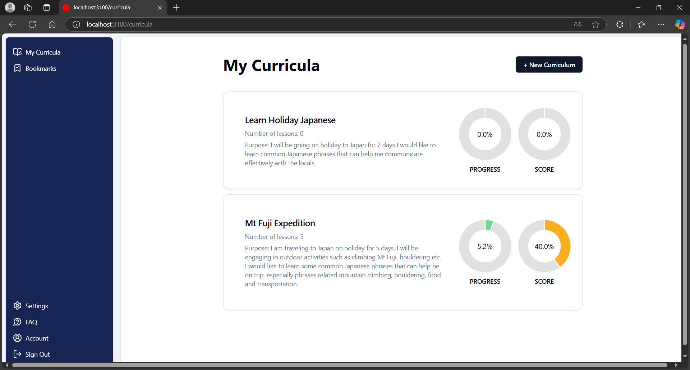
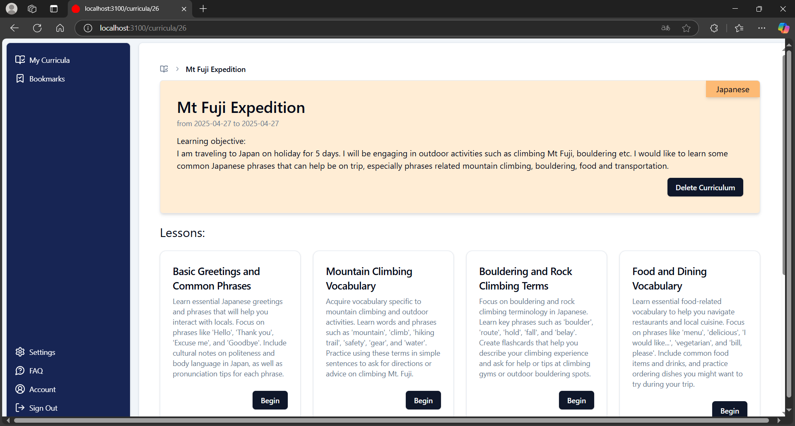
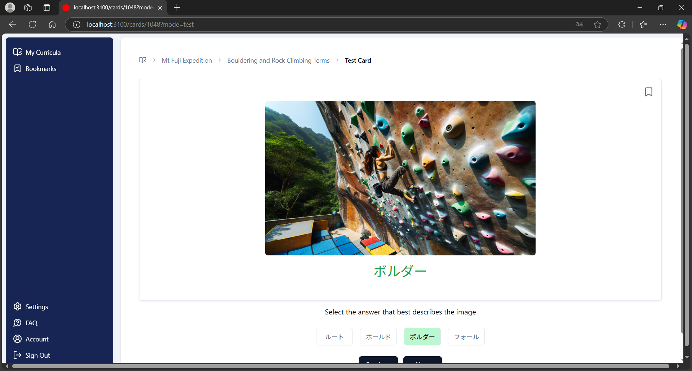

- [My Language App](#my-language-app)
  - [Introduction](#introduction)
    - [MVP Concept](#mvp-concept)
    - [Main Technologies Used](#main-technologies-used)
  - [Key Features](#key-features)
    - [Lesson Generation](#lesson-generation)
    - [Card Generation](#card-generation)
    - [Bookmark Cards](#bookmark-cards)
  - [Development](#development)
    - [Prerequisites](#prerequisites)
    - [Environment Variables](#environment-variables)
    - [Seeding Database](#seeding-database)
    - [Launch Development Server](#launch-development-server)

# My Language App




## Introduction
This was a **3 week long project** built at the end of a **3-month full stack development coding bootcamp** to showcase what we have learnt during the course. 

### MVP Concept
This concept for this minimum viable product (MVP) is a **language learning application** that can **suggest and generate customized lessons** that is tailored to the users' learning needs. This is achieved with Artificial Intelligence (AI) integration.

### Main Technologies Used
- **TypeScript**
- **Ruby on Rails** (backend framework)
- **Vue.js** (frontend framework)
- **TailwindCSS** (CSS framework)
- **PostgreSQL** (database)
- **Inertia.js Rails** (adapter for server-side rendering)
- **OpenAI** (AI integration)
- **Cloudinary** (storage service)

## Key Features
### Lesson Generation
You can enter a prompt to describe the lesson content you wish to learn which will then be sent to OpenAI API to generate the lessons.

[](https://raw.githubusercontent.com/rx-chris/my-language-app/blob/main/docs/media/generate-lessons-demo.mp4)

### Card Generation
A variety of lesson cards are automatically generated by OpenAI. 
- Lesson cards can be toggled between "**Learning Mode**" and "**Quiz Mode**"
- Each card content is **not limited to text** but also includes **audio and image content** as well
- Cards that are answered in "**Quiz Mode**" can be tracked in the **progress bar** that top.

[](https://raw.githubusercontent.com/rx-chris/my-language-app/blob/main/docs/media/lesson-cards-demo.mp4)

### Bookmark Cards
You can bookmark lesson cards that you are interested in to review later.

[](https://raw.githubusercontent.com/rx-chris/my-language-app/blob/main/docs/media/bookmark-demo.mp4)


## Development

### Prerequisites 
- Ruby (3.3.6)
- Ruby on Rails (8.0.1)
- OpenAI account
- Cloudinary account

### Environment Variables
- `OPENAI_ACCESS_TOKEN`: Your OpenAI account's access token.
- `CLOUDINARY_URL`: Your Cloudinary account's access URL
- `CLOUDINARY_FOLDER`: Name of your Cloudinary storage folder

### Seeding Database
The `db/seeds.rb` file is responsible for seeding the database. The **username** and **password** of the test user can be found in this file.
### Launch Development Server

```bash
# install packages
yarn install

# create and seed database
rails db:drop db:create db:migrate db:seed

# launch development server on localhost:3100
bin/dev
```

***
